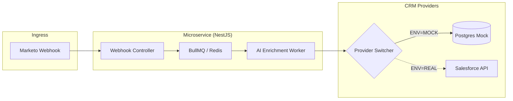

# Lead-to-Revenue Catalyst (RevenueFlow AI)

**RevenueFlow AI** is a high-performance, event-driven microservice engineered to automate the transition from Marketo marketing ingestion to Salesforce sales conversion with AI-driven intent analysis.

## TL;DR
- **Ingestion**: Hardened `POST /leads` endpoint for high-volume Marketo webhooks.
- **Async Boundary**: Immediate decoupling via **BullMQ** (< 200ms ACK) to protect against ingestion spikes.
- **Durability**: Durable, at-least-once processing with idempotency ensures no lead loss during application or downstream outages.
- **Downstream Protection**: Built-in concurrency control and exponential backoff to respect Salesforce and AI API rate limits.
- **Environment Aware**: "Mock-First" local validation (Postgres/Gemini) vs. Hardened production (Salesforce/Bedrock).

## Environment Hub

| Environment | Purpose | Stack Highlights | Documentation |
| :--- | :--- | :--- | :--- |
| **Local** | Validation & Testing | Postgres, Redis, Gemini 2.0 | [Local Stack](docs/local-stack.md) |
| **Production** | Live Revenue Flow | AWS (ECS, RDS, ElastiCache) | [Production Stack](docs/production-stack.md) |
| **Migration** | Mock → Real | Provider Pattern, Rollback Plan | [Migration Guide](docs/migration.md) |

## Architecture



The system maintains state in **PostgreSQL** (audit/idempotency) and **Redis** (queue state). The critical **async boundary** is between the Webhook Controller and the AI Enrichment Worker, ensuring that slow AI inference or CRM sync never blocks the ingestion of new leads.

## Key Design Decisions
- **BullMQ vs. Kafka/SQS**: Selected for its native NestJS integration, low-latency Redis backing, and simplifies retry/backoff and pause/resume semantics in a single-service architecture.
- **Idempotency**: Deterministic SHA-256 hash of `(email, campaign_id)` prevents duplicate CRM records from redundant webhooks.
- **Concurrency Control**: Worker-level throttling ensures we never exceed the "Speed to Lead" SLA while staying within API rate quotas.
- **Retry & DLQ**: Exponential backoff ($2^{attempts} \times 1000ms$) handles transient errors, with a Dead Letter Queue (DLQ) for manual review after 5 failures.

## Scale & Limits (Explicit)
- **Burst Handling**: Designed for bursty webhook traffic (10x–50x spikes during campaigns).
- **Ingestion Optimization**: Ingestion path optimized for fast ACK, not throughput guarantees.
- **Latency Profile**: AI inference dominates p95 latency under load.
- **Ordering**: Ordering guarantees are scoped to `(email, campaign_id)`, not global.
- **Persistence**: Redis is single-region; multi-region durability would require replication or Kafka.

## Failure Modes

| Failure Case | System Response | Recovery Strategy |
| :--- | :--- | :--- |
| **AI API Timeout** | Catch & Log | Retry with backoff; Fallback to `fitScore: 50` if max retries reached. |
| **CRM API Down** | Job Failure | Exponential backoff; Lead remains in Redis until CRM is healthy. |
| **Redis Crash** | Connection Error | BullMQ auto-reconnects; Persistence ensures jobs resume from last state. |
| **Malformed Payload** | 400 Bad Request | Immediate rejection via Zod/class-validator; No queue entry created. |

## Quickstart (Local)

### Prerequisites
- Docker & Docker Compose
- Node.js (v18+)
- Google Gemini API Key

### Setup & Run
1. **Start Infrastructure**:
   ```bash
   docker-compose up -d
   ```
2. **Install & Start**:
   ```bash
   npm install
   npm run start:dev
   ```
3. **Test the Flow**:
   ```bash
   curl -X POST http://localhost:3000/leads \
     -H "Content-Type: application/json" \
     -d '{"email": "lead@enterprise.com", "name": "Alex Smith", "campaign_id": "launch_2024"}'
   ```

---
This project intentionally separates validation (local) from constraints (production).
