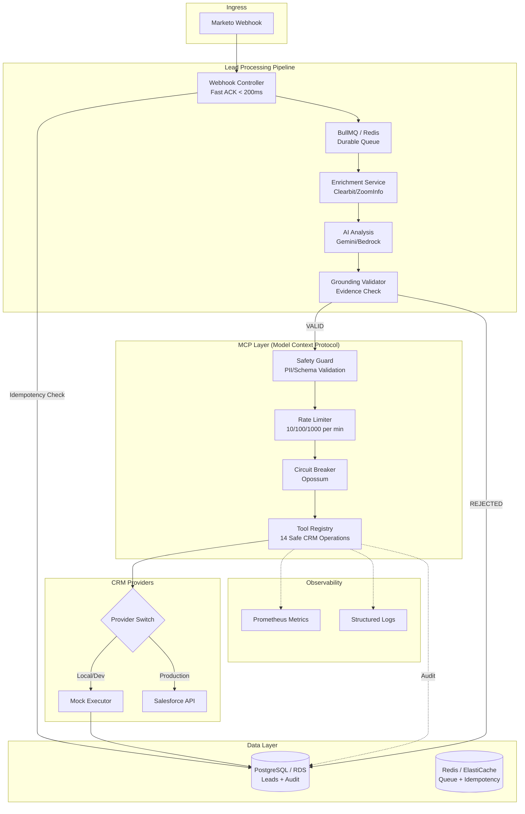

# Lead-to-Revenue Catalyst (RevenueFlow AI)

An AI-powered lead processing pipeline that bridges marketing automation (Marketo) and CRM (Salesforce) with intelligent intent analysis and safe, auditable CRM actions via the Model Context Protocol (MCP).

---

## Problem

B2B sales teams receive thousands of inbound leads from marketing automation (Marketo, HubSpot). Each lead needs to be:

1. **Enriched** with firmographic data (company size, industry, tech stack)
2. **Scored** for sales-readiness using AI
3. **Synced** to CRM (Salesforce) with the appropriate routing

The problem: **AI models hallucinate**. Without validation, an LLM might claim a lead is a "high-intent enterprise prospect" with zero evidence, leading to:

- Sales reps wasting time on bad leads
- CRM data corruption from unvalidated writes
- No way to debug why a lead was scored incorrectly
- API quota exhaustion from uncontrolled CRM calls

## Solution

**RevenueFlow AI** is a production-ready pipeline that solves this with three innovations:

| Layer | What It Does |
|-------|--------------|
| **AI Grounding** | Every AI claim must cite evidence from enrichment data. No evidence = claim rejected. |
| **MCP (Model Context Protocol)** | A safety layer between AI and CRM that enforces rate limits, circuit breakers, and idempotency. |
| **Async Durability** | BullMQ + Redis ensures no lead is lost during downstream outages. |

The result: AI decisions are auditable, CRM writes are safe, and the pipeline handles failures gracefully.

---

## Architecture Overview



### Data Flow

```
Lead Ingestion → Idempotency Check → Enrichment → AI Analysis → Grounding Validation → MCP Safety → CRM Sync
                      ↓                                              ↓
                 [DUPLICATE]                                   [HALLUCINATION]
                Return existing                              Reject + Log to DB
```

**Idempotency Key**: `SHA256(email + campaign_id)` - prevents duplicate leads from the same campaign.

**Rejection Points**:
- **Idempotency Check**: Duplicate leads return the existing record immediately (no queue, no processing)
- **Grounding Validation**: AI hallucinations are rejected and logged to DB for audit

### Key Components

| Component | Technology | Purpose |
|-----------|------------|---------|
| **API** | NestJS + Express | HTTP ingress, validation, orchestration |
| **Queue** | BullMQ + Redis | Async job processing, retries, DLQ |
| **Database** | PostgreSQL | Lead storage, audit logs, idempotency |
| **AI** | Gemini (local) / Bedrock (prod) | Intent classification, scoring |
| **Enrichment** | Clearbit/ZoomInfo | Firmographic data validation |
| **MCP** | Custom implementation | Safe CRM abstraction layer |
| **CRM** | Mock/Salesforce/HubSpot | Provider-pattern switching |

---

## MCP (Model Context Protocol)

The MCP layer is the critical safety boundary between AI decisions and CRM mutations.

### Why MCP?

Traditional AI-to-CRM integrations are dangerous because they allow unrestricted mutations. MCP solves this with:

```
┌─────────────────────────────────────────────────────────────┐
│  WITHOUT MCP                    WITH MCP                     │
│  ────────────                   ────────                     │
│                                                             │
│  AI → Salesforce API            AI → MCP Layer → Salesforce │
│       (Direct, Dangerous)            (Safe, Auditable)      │
│                                                             │
│  [X] No validation              [OK] Schema validation       │
│  [X] No rate limiting           [OK] Multi-tier rate limits  │
│  [X] No circuit breaker         [OK] Failure isolation       │
│  [X] No audit trail             [OK] Full action logging     │
│  [X] PII in logs                [OK] Automatic PII redaction │
│  [X] Duplicate records          [OK] Idempotency guarantees  │
└─────────────────────────────────────────────────────────────┘
```

### MCP Architecture


### MCP Safety Layers

| Layer | Function | Example |
|-------|----------|---------|
| **Grounding** | Validate AI claims against data | "Fintech" claim matches enrichment |
| **Safety Guard** | Block dangerous operations | Reject `delete_*` tool names |
| **Rate Limiting** | Prevent quota violations | 10/min per lead, 1000/min global |
| **Circuit Breaker** | Isolate CRM failures | Open after 5 failures, retry in 30s |
| **PII Redaction** | Protect sensitive data | `john@email.com` → `***@email.com` |
| **Idempotency** | Prevent duplicates | Same `(email, campaign)` = same record |

### MCP Tools (Safe Operations)

| Category | Tools |
|----------|-------|
| **Lead Lifecycle** | `upsert_lead`, `convert_lead`, `update_lead_status` |
| **Account/Contact** | `match_account`, `create_contact` |
| **Sales Workflow** | `create_opportunity`, `update_opportunity_stage` |
| **Activity** | `create_task`, `log_activity`, `sync_firmographics` |

---


## Documentation Index

### Getting Started
| Document | Purpose |
|----------|---------|
| [Local Stack](docs/local-stack.md) | Development environment setup |
| [Testing](docs/testing.md) | Unit, integration, and E2E testing |
| [Migration Guide](docs/migration.md) | Moving from mock to real CRM |

### Architecture and Design
| Document | Purpose |
|----------|---------|
| [AI Grounding](docs/ai_grounding.md) | Evidence-based AI validation contract |
| [MCP Implementation](docs/mcp-implementation-plan.md) | Model Context Protocol deep dive |

### Production
| Document | Purpose |
|----------|---------|
| [Production Stack](docs/production-stack.md) | AWS architecture and scaling |
| [Security](docs/security.md) | Secrets, IAM, and compliance |
| [Observability](docs/observability.md) | Logging, tracing, and monitoring |

---


## Development Workflow

```bash
# Run tests
npm test

# Run E2E tests (requires Docker)
npm run test:e2e

# Lint code
npm run lint

# Format code
npm run format
```

**Pre-push Hook**: All tests must pass before pushing to remote. See `.husky/pre-push`.

---

## License

UNLICENSED - See LICENSE file for details.
